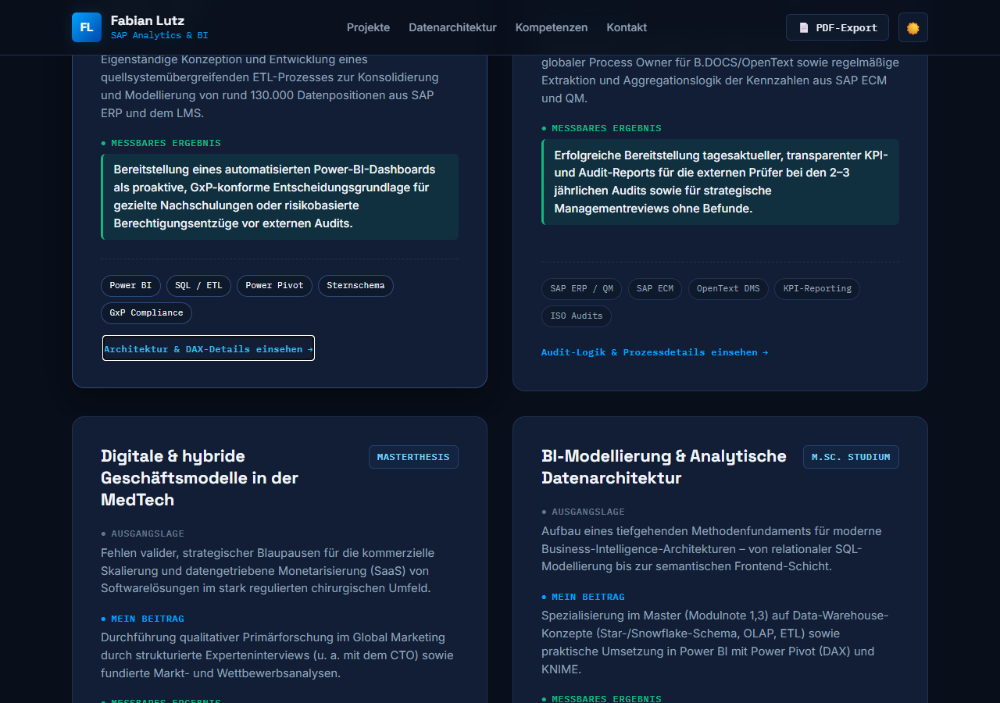

# Fabian Lutz – SAP Analytics Portfolio

> Interaktives Online-Portfolio für den Einstieg in die **SAP-Analytics- und Business-Intelligence-Beratung**.  
> Fokus: Schnittstelle zwischen Geschäftsprozessen, Datenarchitektur und regulierten Unternehmensumfeldern (MedTech / GxP / ISO).



---

## 📌 Über das Portfolio

Dieses Portfolio präsentiert ausgewählte Praxis- und Masterprojekte von **Fabian Lutz** (M.Sc. Digital Business & Management). Es hebt Kernkompetenzen in folgenden Bereichen hervor:

- **SAP & Enterprise Systeme:** SAP ERP, QM, ECM, OpenText DMS
- **Business Intelligence & Analytics:** Power BI, Power Pivot, DAX, KNIME, SQL (DDL/DML)
- **Datenarchitektur & ETL:** Star-/Snowflake-Schema, multidimensionale Modellierung, Schnittstellenkonsolidierung (130.000+ Datensätze)
- **Governance & Compliance:** GxP-Validierung, Audit-Reporting (ISO-Zertifizierungen), Berechtigungssteuerung (600+ Mitarbeitende)
- **Strategie:** Hybride Geschäftsmodelle, SaaS-Monetarisierung, Primärforschung & C-Level-Interviews

---

## ✨ Features & Interaktive Komponenten

- 🌓 **Enterprise Dark & Light Mode:** Nahtloser Farbmodus-Wechsel mit persistenter Speicherung in `localStorage`.
- 🔄 **Interaktive Datenarchitektur-Pipeline:** 4-Stufen-Visualisierung (Quellsysteme $\rightarrow$ ETL $\rightarrow$ Sternschema $\rightarrow$ Power BI Cockpit) mit Klick-Inspektor.
- 🏷️ **Dynamische Projektfilter:** Filterung der Praxisfälle nach *Power BI & DAX*, *SAP ERP & QM*, *ETL & Architektur* sowie *Governance & GxP*.
- 🔍 **Case-Study Deep-Dive Modals:** Detaillierte Architektureinblicke inklusive DAX- und SQL-Snippets sowie methodischer Hintergrund.
- 📄 **Print & PDF-Export:** Vollständig optimiertes Print-Stylesheet (`@media print`) für den direkten A4-Export als 1-2-seitiges Executive Factsheet.
- ⚡ **Geschmeidige KPI-Zähleranimation:** Performance-optimiert via `requestAnimationFrame` und `IntersectionObserver` mit Barrierefreiheitsunterstützung (`prefers-reduced-motion`).

---

## 🚀 Lokale Vorschau & Entwicklung

Das Projekt ist schlank und kann direkt ausgeführt werden:

### Option 1: Schneller lokaler Server (npm)
```bash
npm run dev
# Startet einen lokalen Webserver unter http://localhost:3000
```

### Option 2: Python HTTP Server
```bash
python -m http.server 8000
```
Anschließend im Browser öffnen: [http://localhost:8000](http://localhost:8000)

### Option 3: Automatisierte Tests ausführen
```bash
npm test
# Führt statische Validierungen und Playwright E2E-Tests durch
```

---

## 🌐 Deployment (GitHub Pages)

Das Portfolio ist für **GitHub Pages** optimiert:
1. In den GitHub Repository-Einstellungen unter **Pages** navigieren.
2. Source: **Deploy from a branch** auswählen.
3. Branch: `main` und Folder `/ (root)` auswählen.
4. Nach wenigen Momenten ist die Seite unter `https://<username>.github.io/sap-analytics-portfolio/` live abrufbar.

---

## 🛠 Projektstruktur

```
sap-analytics-portfolio/
├── index.html            # Hauptseite (Responsive HTML5, Semantic CSS, Vanilla JS)
├── package.json          # npm-Konfiguration, Skripte & DevDependencies
├── README.md             # Projektdokumentation & Quickstart
├── .gitignore            # Git-Ausschlussregeln
├── test_portfolio.js     # Statischer Komponenten- und Validierungstest
├── playwright_test.js    # Playwright E2E-Testsuite & Screenshot-Generator
└── portfolio_preview.png # Portfolio-Vorschaubild
```

---

## 📬 Kontakt

- **Fabian Lutz** – M.Sc. Digital Business & Management
- ✉️ [lutzfabi2@gmail.com](mailto:lutzfabi2@gmail.com)
- 💼 [LinkedIn Profil](https://linkedin.com/in/fabian-lutz-459b13169/)
- 📞 +49 1520 6202863